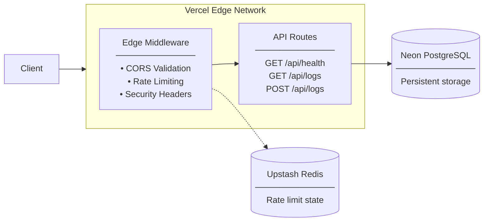

<p align="center">
  <h1 align="center">Edge Secure API</h1>
  <p align="center">A production-grade Edge API built with Next.js, running on Vercel's Edge Runtime with serverless PostgreSQL and Redis rate limiting.</p>
</p>

<p align="center">
  <a href="https://nextjs.org"></a>
  <a href="https://www.typescriptlang.org"></a>
  <a href="https://neon.tech"></a>
  <a href="https://upstash.com"></a>
  <a href="https://vercel.com"></a>
  <a href="LICENSE"></a>
</p>

---

## Features

- **Edge Runtime** — All routes execute on Vercel's Edge Runtime for minimal latency worldwide
- **Serverless PostgreSQL** — Neon database with connection pooling via `@neondatabase/serverless`
- **Distributed Rate Limiting** — Per-IP atomic counters via Upstash Redis (50 requests per 10-second window)
- **Edge Middleware** — CORS enforcement, rate limiting, and security headers applied at the network edge
- **CORS Allowlist** — Strict origin validation from `ALLOWED_ORIGINS` environment variable
- **Security Headers** — `X-Frame-Options`, `X-Content-Type-Options`, `Referrer-Policy`, `Permissions-Policy`
- **Payload Validation** — 1 MB size limit, JSON structure validation, content-type checks
- **Encrypted Payload Support** — Accept and store opaque ciphertext without inspection
- **Parameterized SQL** — All database queries use parameterized statements via `@neondatabase/serverless`
- **Fail-Open Resilience** — Rate limiter unavailability does not block legitimate requests
- **Health Endpoint** — `GET /api/health` for uptime monitoring
- **Log CRUD** — `GET /api/logs` (list) and `POST /api/logs` (create)
- **Concurrent Load Testing** — Scripts to verify rate limiting under concurrent load

---

## Architecture



Requests arrive at Vercel's Edge Network and pass through the Edge Middleware, which enforces CORS rules, checks rate limits via Upstash Redis, and applies security headers. Allowed requests proceed to the API route handlers, which interact with Neon PostgreSQL for persistent storage.

---

## Tech Stack

| Category | Technology |
|----------|-----------|
| Runtime / Framework | [Next.js](https://nextjs.org/) 15.5 (App Router) — [Edge Runtime](https://nextjs.org/docs/app/api-reference/edge) |
| Language | [TypeScript](https://www.typescriptlang.org/) 5.8 |
| Database | [Neon](https://neon.tech/) — Serverless PostgreSQL with `@neondatabase/serverless` |
| Rate Limiter | [Upstash Redis](https://upstash.com/) — REST-based atomic counters via `@upstash/redis` |
| Styling | [Tailwind CSS](https://tailwindcss.com/) 4.1 (landing page only) |
| Deployment | [Vercel](https://vercel.com/) — Edge Functions |
| Testing | Node.js 18+ (`fetch` API) / PowerShell 7+ (`ForEach-Object -Parallel`) |

---

## Folder Structure

```
edge-secure-api/
├── public/                  # Static assets
├── src/
│   ├── app/
│   │   ├── api/
│   │   │   ├── debug/
│   │   │   │   └── redis/   # GET  /api/debug/redis — Redis diagnostics
│   │   │   ├── health/      # GET  /api/health
│   │   │   └── logs/        # GET  /api/logs, POST /api/logs
│   │   ├── layout.tsx       # Root layout
│   │   └── page.tsx         # Landing page
│   ├── lib/
│   │   ├── db.ts            # Neon PostgreSQL client singleton
│   │   └── redis.ts         # Upstash Redis client singleton
│   └── middleware.ts        # Edge middleware (CORS, rate limiting, security headers)
├── tests/
│   ├── load-test.mjs        # Node.js concurrent load test
│   └── load-test.ps1        # PowerShell concurrent load test
├── .env.example             # Environment variable template
├── .gitignore
├── LICENSE
├── next.config.ts
├── package.json
├── postcss.config.mjs
├── tailwind.config.ts
└── tsconfig.json
```

---

## API Endpoints

### `GET /api/health`

Returns the current health status of the API. Bypasses rate limiting entirely.

**Response `200`**

```json
{
  "success": true,
  "status": "ok",
  "timestamp": "2026-07-08T12:00:00.000Z"
}
```

---

### `GET /api/logs`

Retrieves all log entries ordered by creation date (newest first).

**Response `200`**

```json
{
  "success": true,
  "count": 2,
  "data": [
    {
      "id": 2,
      "message": "Hello Edge",
      "created_at": "2026-07-08T12:01:00.000Z"
    },
    {
      "id": 1,
      "message": "System started",
      "created_at": "2026-07-08T12:00:00.000Z"
    }
  ]
}
```

**Response `500`**

```json
{
  "success": false,
  "error": "Internal server error"
}
```

---

### `POST /api/logs`

Creates a new log entry. Supports two payload formats.

<details>
<summary><strong>Standard Message</strong></summary>

**Request**

```json
{
  "message": "Hello Edge"
}
```

**Response `201`**

```json
{
  "success": true,
  "message": "Log created successfully",
  "data": {
    "id": 3,
    "message": "Hello Edge",
    "created_at": "2026-07-08T12:02:00.000Z"
  }
}
```

**Error `400` — message is missing**

```json
{
  "success": false,
  "error": "message is required"
}
```

**Error `400` — message is empty**

```json
{
  "success": false,
  "error": "message must not be empty"
}
```

</details>

<details>
<summary><strong>Encrypted Payload</strong></summary>

**Request**

```json
{
  "encrypted": true,
  "ciphertext": "<opaque encrypted string>"
}
```

**Response `201`**

```json
{
  "success": true,
  "message": "Log created successfully",
  "data": {
    "id": 4,
    "message": "<opaque encrypted string>",
    "created_at": "2026-07-08T12:03:00.000Z"
  }
}
```

**Error `400` — ciphertext is missing**

```json
{
  "success": false,
  "error": "ciphertext is required"
}
```

</details>

<details>
<summary><strong>Shared Errors</strong></summary>

**Error `413` — request body exceeds 1 MB**

```json
{
  "success": false,
  "error": "Payload too large"
}
```

**Error `400` — malformed JSON**

```json
{
  "success": false,
  "error": "Invalid JSON in request body"
}
```

**Error `400` — valid JSON but not an object**

```json
{
  "success": false,
  "error": "Request body must be a JSON object"
}
```

</details>

#### HTTP Status Codes

| Code | Meaning |
|------|---------|
| `200` | Request succeeded |
| `201` | Resource created |
| `400` | Invalid request body |
| `403` | Origin not allowed by CORS |
| `413` | Payload exceeds 1 MB limit |
| `429` | Rate limit exceeded |
| `500` | Internal server error |

---

## Security Features

### Edge Middleware

All API requests pass through `src/middleware.ts` before reaching route handlers. The middleware applies three layers of protection in sequence:

1. **CORS Enforcement** — Validates the `Origin` header against a configurable allowlist (`ALLOWED_ORIGINS`). Unknown origins receive a `403` response.
2. **Distributed Rate Limiting** — Per-IP sliding-window rate limiting using Upstash Redis atomic `INCR` + `EXPIRE`. Configured at 50 requests per 10-second window. When the threshold is exceeded, the client receives a `429` response.
3. **Security Headers** — Every response receives `X-Frame-Options: DENY`, `X-Content-Type-Options: nosniff`, `Referrer-Policy: strict-origin-when-cross-origin`, and `Permissions-Policy` headers.

### Database Security

- All queries use **parameterized SQL statements** via `@neondatabase/serverless`, preventing injection attacks.
- The `message` field is stored as-is — no dynamic SQL construction.

### Fail-Open Design

If the Redis rate limiter is unavailable (network error, timeout, misconfiguration), the middleware logs the error and **allows the request through** rather than returning a `5xx` error. This prevents a rate-limiting outage from taking down the entire API.

### Authentication

Authentication is **not implemented** in this project. The focus is on edge middleware patterns, distributed rate limiting, and secure serverless database access. Authentication (JWT, OAuth, API keys) is listed under [Future Improvements](#future-improvements).

---

## Environment Variables

| Variable | Description | Required |
|----------|-------------|----------|
| `DATABASE_URL` | Neon PostgreSQL connection string with `sslmode=require` | Yes |
| `UPSTASH_REDIS_REST_URL` | Upstash Redis REST API endpoint (`https://*.upstash.io`) | Yes |
| `UPSTASH_REDIS_REST_TOKEN` | Upstash Redis REST API token | Yes |
| `ALLOWED_ORIGINS` | Comma-separated list of allowed CORS origins | Yes |
| `NEXT_PUBLIC_APP_URL` | Public URL of the deployed instance | No |

See `.env.example` for a template.

---

## Local Development

### Prerequisites

- Node.js 18+ (required for the built-in `fetch` API used in load tests)
- npm
- A [Neon](https://neon.tech/) PostgreSQL project (free tier)
- An [Upstash Redis](https://upstash.com/) database (free tier)

### Setup

```bash
# Clone the repository
git clone <repository-url>
cd edge-secure-api

# Install dependencies
npm install

# Copy environment variables
cp .env.example .env.local
# Fill in your credentials in .env.local

# Start the development server
npm run dev
```

The server starts at `http://localhost:3000`.

### Available Scripts

| Command | Description |
|---------|-------------|
| `npm run dev` | Start development server with hot reload |
| `npm run build` | Create an optimized production build |
| `npm run start` | Start production server (after build) |
| `npm run lint` | Run ESLint |

---

## Deployment

### Database Setup

1. Create a [Neon](https://neon.tech/) project (free tier).
2. Copy the connection string from the Neon dashboard.
3. Run the schema migration to create the `logs` table:

```sql
CREATE TABLE IF NOT EXISTS logs (
  id SERIAL PRIMARY KEY,
  message TEXT NOT NULL,
  created_at TIMESTAMP WITH TIME ZONE DEFAULT CURRENT_TIMESTAMP
);
```

### Redis Setup

1. Create an [Upstash Redis](https://upstash.com/) database (free tier).
2. Copy the REST URL and token from the Upstash dashboard.

### Vercel

```bash
# Install the Vercel CLI
npm install -g vercel

# Log in
vercel login

# Link your project
vercel link

# Add environment variables
vercel env add DATABASE_URL
vercel env add UPSTASH_REDIS_REST_URL
vercel env add UPSTASH_REDIS_REST_TOKEN
vercel env add ALLOWED_ORIGINS
vercel env add NEXT_PUBLIC_APP_URL

# Deploy to production
vercel --prod
```

Alternatively, configure the environment variables in the Vercel dashboard under **Project Settings → Environment Variables**.

---

## Testing

### Health Endpoint

```bash
curl https://your-project.vercel.app/api/health
```

### Logs Endpoint

```bash
# List logs
curl https://your-project.vercel.app/api/logs

# Create a log
curl -X POST https://your-project.vercel.app/api/logs \
  -H "Content-Type: application/json" \
  -d '{"message": "Hello Edge"}'
```

### Concurrent Load Testing

Two scripts are provided to verify the distributed rate limiter under concurrent load. Each sends 60 simultaneous requests to `GET /api/logs` and reports the status code distribution.

<details>
<summary><strong>Node.js</strong></summary>

```bash
node tests/load-test.mjs
```

Requires Node.js 18+ (built-in `fetch`). Configure the target URL via the `TARGET` environment variable:

```bash
TARGET=https://your-project.vercel.app/api/logs node tests/load-test.mjs
```

</details>

<details>
<summary><strong>PowerShell</strong></summary>

```powershell
pwsh -File tests/load-test.ps1
```

Requires PowerShell 7+ (`ForEach-Object -Parallel`). Configure the target URL via the `TARGET` environment variable:

```powershell
$env:TARGET="https://your-project.vercel.app/api/logs"
pwsh -File tests/load-test.ps1
```

</details>

#### Expected Output

When the rate limiter is functioning correctly, approximately **50 requests return `200`** and **10 return `429`**:

```
200 : 50
429 : 10
Elapsed: 1.2 seconds
```

The exact distribution may vary slightly due to network timing, but the rate limiter reliably returns `429` after the 50-request threshold is exceeded within the 10-second window.

---

## Example Responses

### `200` — Success

```json
{
  "success": true,
  "status": "ok",
  "timestamp": "2026-07-08T12:00:00.000Z"
}
```

### `201` — Created

```json
{
  "success": true,
  "message": "Log created successfully",
  "data": {
    "id": 3,
    "message": "Hello Edge",
    "created_at": "2026-07-08T12:02:00.000Z"
  }
}
```

### `400` — Bad Request

```json
{
  "success": false,
  "error": "message is required"
}
```

### `403` — Forbidden (CORS)

```json
{
  "success": false,
  "error": "Origin not allowed"
}
```

### `413` — Payload Too Large

```json
{
  "success": false,
  "error": "Payload too large"
}
```

### `429` — Rate Limit Exceeded

```json
{
  "success": false,
  "error": "Too many requests"
}
```

### `500` — Internal Server Error

```json
{
  "success": false,
  "error": "Internal server error"
}
```

---

## Future Improvements

- [ ] JWT or OAuth authentication
- [ ] Role-based authorization
- [ ] Structured request logging and observability
- [ ] Metrics dashboard (request rates, error rates, latency percentiles)
- [ ] OpenAPI / Swagger documentation
- [ ] Docker image for local development
- [ ] CI/CD pipeline with GitHub Actions
- [ ] Automated database migrations via Neon branching

---

## License

[MIT](LICENSE) © 2026 Jash Ajmera
